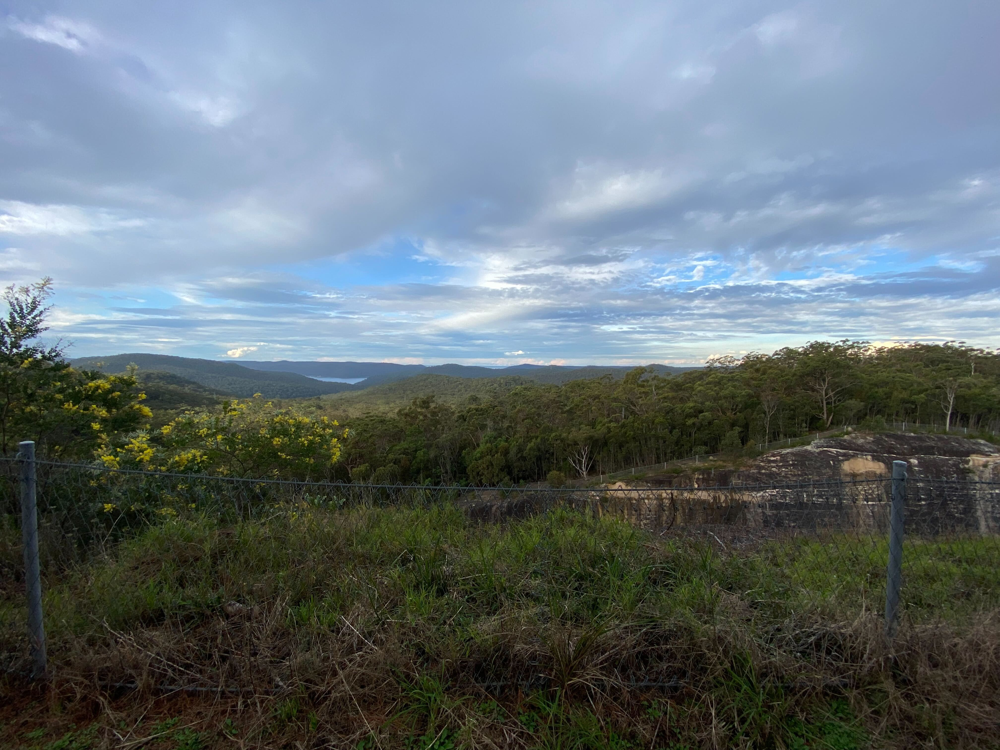

# Alejandro Sanchez Giraldo 

| [Contact me](mailto:alejandrosanchezau@yahoo.com.au) |[Follow me on LinkedIn](https://www.linkedin.com/in/alejandrosanchezgiraldo) |
| - | - |

## Personal Statement

I see myself as the Product Owner for Quality and the person that will collaborate with teams to ensure we build capabilities to uplift an organisation’s quality. I am a strong believer in building community and enjoy working with internal and external teams to drive quality as a common goal while expanding individuals' capabilities. 

Metrics are an essential way of how I do work. I enjoy building the right scorecards for each team to ensure data-driven decisions take place, and the relevant capabilities are built. I am not shy and like to present the team success to stakeholders as well as taking responsibility for our mistakes. I am a firm believer of fail fast, fail often, learn from your mistakes and don't repeat them. 

## My recent achievements

-   Create and deliver a strategic roadmap to evolve from testing services into Quality Engineering capabilities in 2 major Enterprises. [Read more](achivements/From%20test%20to%20Quality%20Engineering.md)
- 3 major projects for Qantas Loyalty
    - Titanium credit card
    - Qantas Travel Money re-platform
    - Qantas Car Insurance

