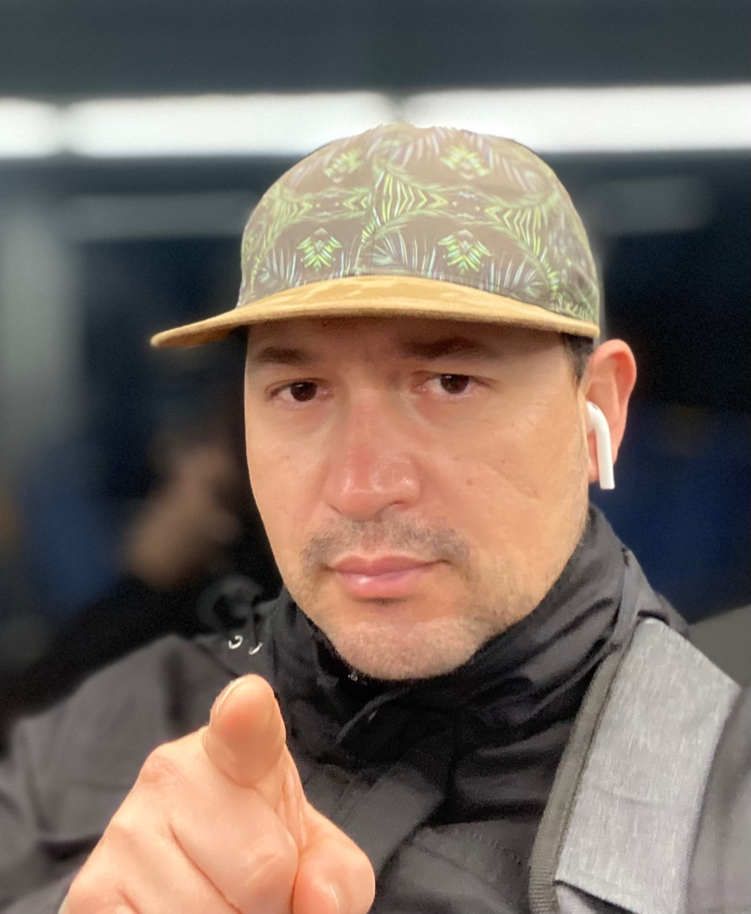

# Alejandro Sanchez-Giraldo 
🛠️ Helping Teams Engineer Quality | 🗣️ Product Owner for Quality | Head of Quality Engineering and Observability

| [Contact me](mailto:alejandrosanchezau@yahoo.com.au) | [Follow me on LinkedIn](https://www.linkedin.com/in/alejandrosanchezgiraldo){:target="_blank"} | [Portfolio](https://github.com/ale-sanchez-g?tab=repositories){:target="_blank"}

## Personal Statement

I am a Product Owner for Quality who is passionate about engineering quality into everything I do. I believe that quality is everyone's responsibility, and I enjoy working with teams to create a culture of quality. I am also a strong believer in data should be the only influence to decision-making, for any product to succeed.

## Achievements

• 📈 Create and deliver a strategic roadmap to evolve from testing services into Quality Engineering capabilities

• 🙋‍♂️ Leading and developing teams towards building quality in their delivery process.

• 🛠️ Exploring DevSecOps tools to enable self-service for quality capabilities.

• 👁️ Strengthening Observability practices to enable faster and secure troubleshooting

[Work Experience](/reference/WORKEXPERIENCE.MD)

[Publications](/reference/PUBLICATIONS.MD)

[Conferences](/reference/CONFERENCES.MD)