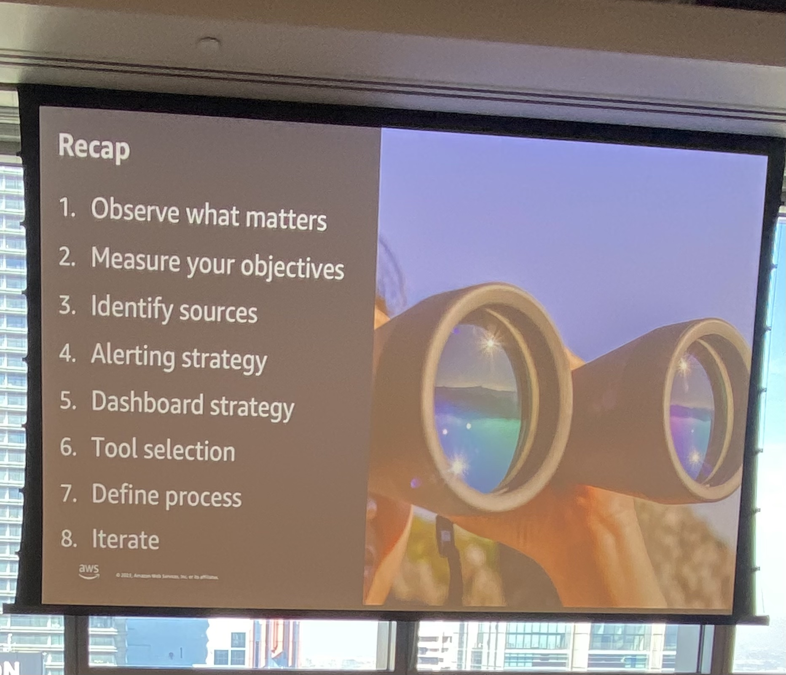

## Summary

```
ANZ Observability Day - Sydney
Date: Thursday, September 14, 2023
Time: 9:30AM - 4:00PM AEST
Venue: AWS Sydney Office, Level 37, 2 Park Street, Sydney NSW 2000
```

The notes outline a strategy for observability in AWS (Amazon Web Services) and emphasize the importance of transitioning from traditional monitoring to observability due to the complexities of distributed systems, the proliferation of devices (mobile, IoT), constant change, and the generation of vast amounts of data. The strategy is broken down into the "Why," "What," and "How."

### Why:

- **Evolution to Observability:** Recognizing the need to move from reactive monitoring to proactive observability.
- **Constant Change:** Acknowledging the challenges posed by distributed systems and the dynamic nature of modern applications.
- **Data Volume:** Highlighting the importance of handling and deriving insights from large amounts of data.

### What to Observe:

1. **Customer Needs:** Understanding customer preferences and requirements, including factors like location, choice, price, security, page speed, and search.
2. **Internal Customer:** Focusing on the needs of internal stakeholders.
3. **Visualizations/Dashboards:** Creating dashboards that align with business goals, KPIs, and objectives, with a focus on site availability and performance.
4. **Sessions and Canary Testing:** Monitoring sessions and conducting synthetic testing (canary testing) against applications.

### How:

1. **Alerting Strategy:** Defining criteria for warnings, alerts, and alarms, ensuring actionable alerts and avoiding alert fatigue.
2. **Automation:** Implementing automation for alert actions where possible.
3. **Thresholds and Runbooks:** Continuously reviewing and updating alert thresholds and runbooks after incidents.
4. **Dashboards/Visualizations:** Creating dashboards tailored to various personas (business, cost, capacity planning, security) and using them for predictive analysis.
5. **Tool Selection:** Selecting the right tools based on specific needs, features, and business value, while avoiding redundancy.
6. **Documentation:** Creating documentation for runbooks, playbooks, access, and education, and integrating observability into internal processes.
7. **Continuous Improvement:** Implementing iterative processes for baseline establishment, review cycles, and ongoing improvement without overwhelming resources.

Overall, the strategy encourages a customer-centric approach, automation, and the strategic use of tools to ensure effective observability in AWS environments while keeping the focus on business goals and delivering value.



[Back home](/)
